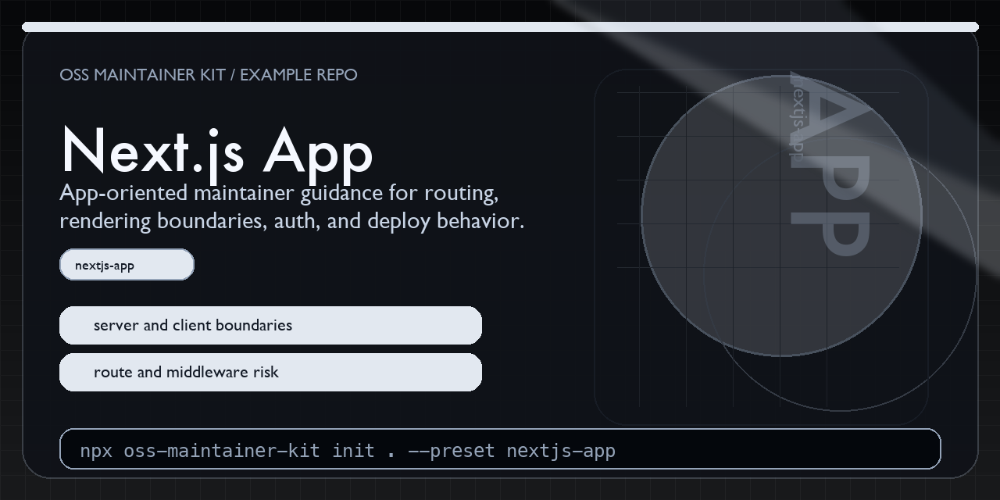

# OSS Maintainer Kit Next.js Example



This repository shows what the `nextjs-app` preset from [oss-maintainer-kit](https://github.com/BlakeHampson/oss-maintainer-kit) looks like after scaffolding.

It was generated with:

```bash
npx oss-maintainer-kit init . \
  --repo-name oss-maintainer-kit-nextjs-example \
  --maintainer "Blake Hampson" \
  --preset nextjs-app
```

## Why this repo exists

It is a concrete example for maintainers running a Next.js app where route behavior, environment boundaries, previews, and deploy assumptions need clearer review guidance.

## Quick scan

- `AGENTS.md`: routing, rendering, env var, and deploy-focused review guidance
- `docs/START_HERE.md`: the shortest path to understanding the generated maintainer files
- `docs/MAINTAINER_WORKFLOW.md`: how to review app changes that affect users and deploys
- `docs/DEPLOYMENT.md`: example deploy notes maintainers should keep current
- `docs/ARCHITECTURE.md`: example boundary and system-context notes for reviewers
- `app/README.md`: example app-surface notes worth reviewing before merge
- `.github/workflows/ci-smoke.yml`: editable starting point for build and smoke checks, with npm, pnpm, and yarn starter detection

## What this preset is trying to optimize

- fewer silent regressions in routes, auth, and config
- clearer server-versus-client review expectations
- deploy guidance that still makes sense for a solo maintainer

## Related project

- Main tool: <https://github.com/BlakeHampson/oss-maintainer-kit>
- npm package: <https://www.npmjs.com/package/oss-maintainer-kit>
